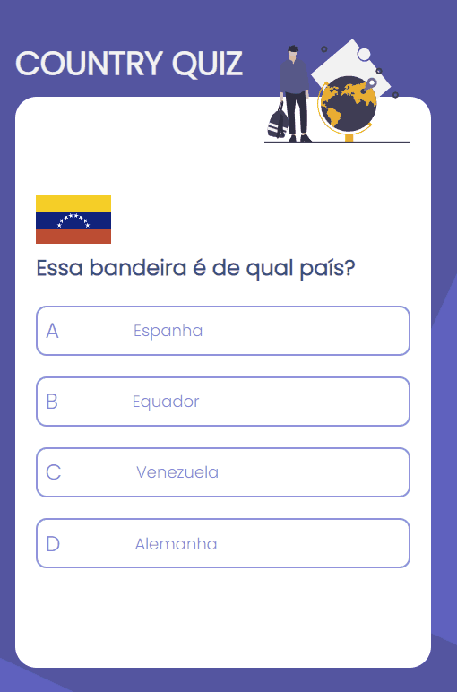

<h1 align="center">Country Quiz</h1>

<h2>Tabela de Conteúdos</h2>
<ul>
    <li><a href="#visaoGeral">Visão geral</a>
    </li>
    <li><a href="#sobre">Sobre o projeto</a></li>
    <li><a href="#recursos">Recursos</a></li>
    <li><a href="#construidoCom">Construído com</a></li>
    <li><a href="#comoUtilizar">Como utilizar
</a></li>
</ul>

<h2 align="center" id="visaoGeral">Visão geral</h2>

<h2 id="sobre" align="center">Sobre o projeto</h2>
<p>Esse jogo de quiz foi construído através do consumo da api <a href="https://restcountries.com/">Rest Countries</a>. Você pode conferi-lo através desse <a href="https://quiz-paises.netlify.app/">link</a>. Construir esse site foi uma ótima experiência para colococar em prática conceitos de React Hooks e consumo de API utilizando Axios, e através do mesmo fui capaz de melhorar minhas habilidades de Css, React e Redux.</p>

<h2 id="recursos" align="center">Recursos</h2>
<p>Essa aplicação foi criada como uma submissão para o desafio do site <a href="https://devchallenges.io/challenges">DevChallenges</a>. O desafio era construir uma aplicação para completar as histórias do usuário.</p>
<h2 id="construidoCom" align="center">Construído com</h2>
<ul>
    <li>React</li>
    <li>Hooks</li>
    <li>Redux</li>
    <li>Redux-Thunk</li>
    <li>Axios</li>
    <li>Css</li>
    <li>Media Queries</li>
</ul>

<h2 id="comoUtilizar" align="center">Como utilizar</h2>
<p>Você pode acessar essa aplicação através desse <a href="https://quiz-paises.netlify.app">link</a> ou rodar através do seu computador da seguinte forma: </p>
<br>

Para clonar e rodar essa aplicação você precisará do [Git](https://git-scm.com) e do [Node.js](https://nodejs.org/en/download/) (que vem com o [npm](http://npmjs.com)) instalado no seu computador. No terminal de comando:

```bash
# Clone esse repositório
$ git clone https://github.com/your-user-name/your-project-name

# Install dependencies
$ npm install

# Run the app
$ npm start
```
